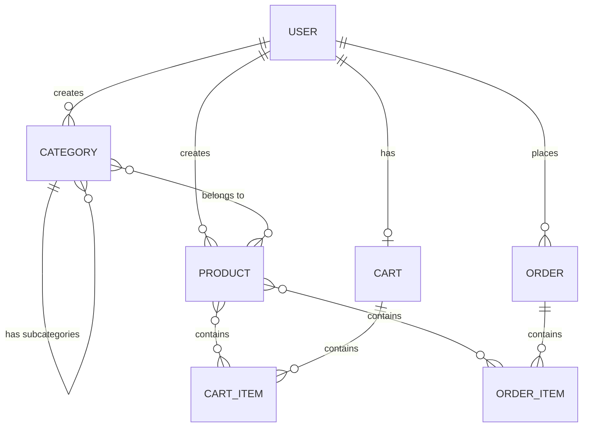
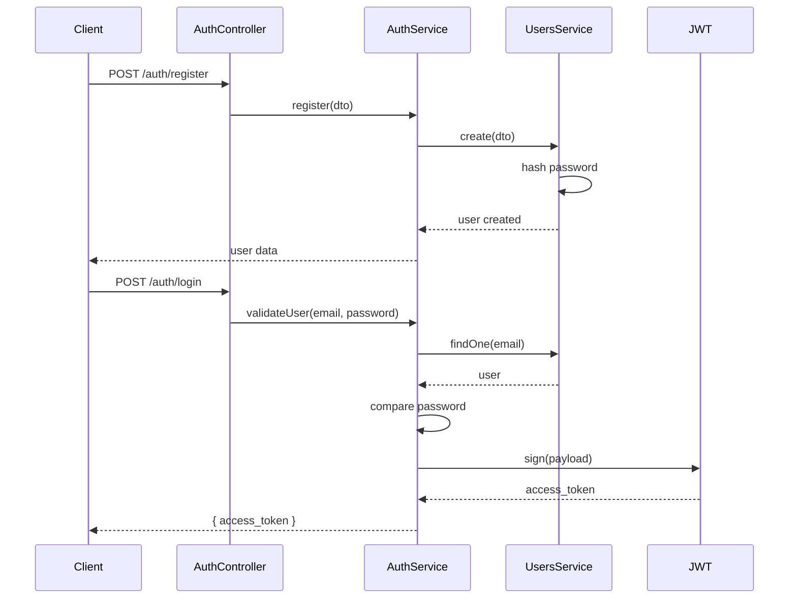
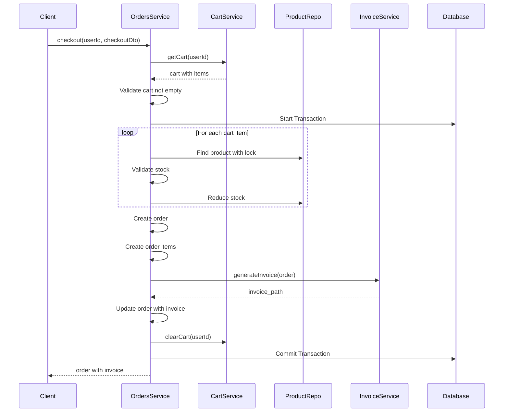
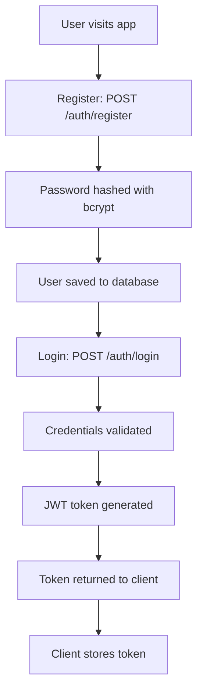
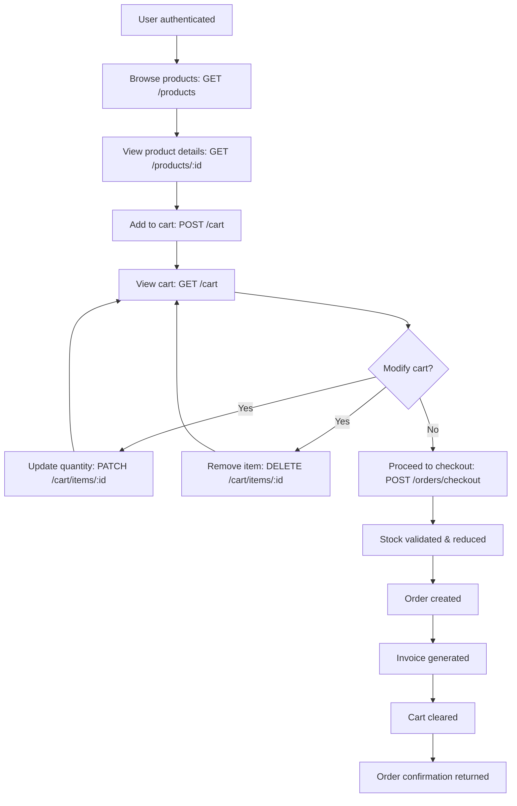
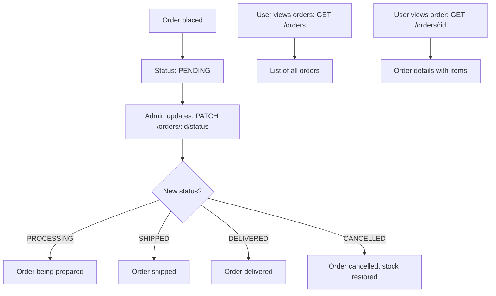

# NestJS E-Commerce Backend - Project Flow Explanation

## 📋 Table of Contents
1. [Project Overview](#project-overview)
2. [Technology Stack](#technology-stack)
3. [Architecture Overview](#architecture-overview)
4. [Database Schema & Relationships](#database-schema--relationships)
5. [Module-by-Module Flow](#module-by-module-flow)
6. [Complete User Journey Flow](#complete-user-journey-flow)
7. [API Endpoints Summary](#api-endpoints-summary)
8. [Security & Authentication](#security--authentication)

---

## 🎯 Project Overview

This is a **full-featured E-Commerce Backend API** built with NestJS, TypeScript, PostgreSQL, and TypeORM. The application provides complete functionality for:

- User authentication & authorization (JWT-based)
- Product catalog management with categories
- Shopping cart operations
- Order processing with invoice generation
- Stock management
- Payment tracking

---

## 🛠 Technology Stack

| Technology | Purpose |
|------------|---------|
| **NestJS** | Backend framework (Node.js) |
| **TypeScript** | Type-safe programming |
| **PostgreSQL** | Relational database |
| **TypeORM** | ORM for database operations |
| **JWT** | Authentication tokens |
| **Passport** | Authentication middleware |
| **bcrypt** | Password hashing |
| **PDFKit** | Invoice PDF generation |
| **Multer** | File upload handling |

---

## 🏗 Architecture Overview

The application follows **NestJS modular architecture** with clear separation of concerns:

```
src/
├── auth/           # Authentication & authorization
├── users/          # User management
├── categories/     # Category & subcategory management
├── products/       # Product catalog
├── cart/           # Shopping cart operations
├── orders/         # Order processing & invoices
└── app.module.ts   # Root module
```

### Module Structure Pattern
Each module follows the standard NestJS pattern:
- **Entity**: Database table definition (TypeORM)
- **DTO**: Data Transfer Objects for validation
- **Service**: Business logic
- **Controller**: HTTP request handlers
- **Module**: Dependency injection container

---

## 🗄 Database Schema & Relationships

### Entity Relationship Diagram



### Key Relationships

1. **User → Categories/Products** (One-to-Many)
   - Each user can create multiple categories and products
   - Products and categories are user-scoped (multi-tenant)

2. **Category → Category** (Self-Referencing)
   - Categories can have parent categories (subcategories)
   - Hierarchical tree structure support

3. **Product ↔ Category** (Many-to-Many)
   - Products can belong to multiple categories
   - Join table: `product_categories`

4. **User → Cart** (One-to-One)
   - Each user has one active cart
   - Cart persists across sessions

5. **Cart → CartItems** (One-to-Many)
   - Cart contains multiple items
   - Each item references a product and quantity

6. **User → Orders** (One-to-Many)
   - Users can place multiple orders
   - Orders are immutable after creation

7. **Order → OrderItems** (One-to-Many)
   - Each order contains multiple items
   - Snapshot of product details at order time

---

## 📦 Module-by-Module Flow

### 1️⃣ Users Module

**Purpose**: Manage user accounts and profiles

**Entity Structure** ([user.entity.ts](file:///f:/nest-project/src/users/entities/user.entity.ts)):
```typescript
User {
  id: number
  full_name: string
  email: string (unique)
  password: string (hashed)
  phone: string
  address: string
  created_at: Date
}
```

**Key Operations**:
- `create()`: Register new user with bcrypt password hashing
- `findOne()`: Find user by email
- `findById()`: Find user by ID

---

### 2️⃣ Auth Module

**Purpose**: Handle authentication and authorization

**Flow**:


**Key Features**:
- **Registration**: Creates user with hashed password
- **Login**: Validates credentials and returns JWT token
- **JWT Strategy**: Validates tokens on protected routes
- **Guards**: `@UseGuards(JwtAuthGuard)` protects endpoints

---

### 3️⃣ Categories Module

**Purpose**: Manage product categories with hierarchical structure

**Entity Structure** ([category.entity.ts](file:///f:/nest-project/src/categories/entities/category.entity.ts)):
```typescript
Category {
  id: number
  name: string
  user_id: number
  parent_id: number (nullable)
  parent: Category (self-reference)
  children: Category[]
  products: Product[]
}
```

**Key Features**:
- **Hierarchical Categories**: Support for subcategories (parent-child relationship)
- **Tree Building**: `buildTree()` method constructs category hierarchy
- **Circular Reference Prevention**: Validates parent-child relationships
- **User Scoping**: Each user has their own categories

**Example Flow**:
```
Electronics (parent_id: null)
├── Laptops (parent_id: 1)
│   ├── Gaming Laptops (parent_id: 2)
│   └── Business Laptops (parent_id: 2)
└── Phones (parent_id: 1)
```

---

### 4️⃣ Products Module

**Purpose**: Manage product catalog

**Entity Structure** ([product.entity.ts](file:///f:/nest-project/src/products/entities/product.entity.ts)):
```typescript
Product {
  id: number
  name: string
  price: decimal
  description: string
  stock: number
  image_url: string
  user_id: number
  categories: Category[] (Many-to-Many)
}
```

**Key Features**:
- **Multiple Categories**: Products can belong to multiple categories
- **Stock Management**: Tracks available inventory
- **Image Upload**: Supports product images via Multer
- **User Scoping**: Products are user-specific

**CRUD Operations**:
- `create()`: Validates categories belong to user
- `findAll()`: Returns user's products with categories
- `update()`: Updates product and category associations
- `remove()`: Deletes product

---

### 5️⃣ Cart Module

**Purpose**: Manage shopping cart operations

**Entity Structure**:
```typescript
Cart {
  id: number
  user_id: number
  items: CartItem[]
}

CartItem {
  id: number
  cart_id: number
  product_id: number
  quantity: number
  product: Product
}
```

**Key Operations**:

1. **Get Cart** (`getCart()`):
   - Creates cart if doesn't exist
   - Calculates subtotal, tax (10%), and total
   - Returns cart with summary

2. **Add to Cart** (`addToCart()`):
   - Validates product exists and has stock
   - If product already in cart, increases quantity
   - Otherwise, creates new cart item
   - Validates stock availability

3. **Update Cart Item** (`updateCartItem()`):
   - Updates quantity for existing item
   - Validates stock availability

4. **Remove Cart Item** (`removeCartItem()`):
   - Removes specific item from cart

5. **Clear Cart** (`clearCart()`):
   - Removes all items from cart

**Stock Validation**:
```typescript
if (product.stock < quantity) {
  throw new BadRequestException(`Insufficient stock. Only ${product.stock} items available`);
}
```

---

### 6️⃣ Orders Module

**Purpose**: Process orders, manage stock, generate invoices

**Entity Structure** ([order.entity.ts](file:///f:/nest-project/src/orders/entities/order.entity.ts)):
```typescript
Order {
  id: number
  user_id: number
  order_number: string (unique)
  status: OrderStatus (PENDING, PROCESSING, SHIPPED, DELIVERED, CANCELLED)
  payment_method: PaymentMethod (CASH_ON_DELIVERY, CREDIT_CARD, DEBIT_CARD, UPI)
  payment_status: boolean
  subtotal: decimal
  tax: decimal
  discount: decimal
  total: decimal
  shipping_address: string
  phone: string
  invoice_path: string
  items: OrderItem[]
}

OrderItem {
  id: number
  order_id: number
  product_id: number
  quantity: number
  price: decimal (snapshot at order time)
  product: Product
}
```

**Checkout Flow** (`checkout()`):



**Key Features**:

1. **Transaction Safety**: Uses database transactions for atomicity
2. **Pessimistic Locking**: Prevents race conditions on stock updates
3. **Stock Reduction**: Automatically reduces product stock
4. **Order Number Generation**: Unique order numbers (ORD-timestamp-random)
5. **Invoice Generation**: PDF invoices using PDFKit
6. **Cart Clearing**: Empties cart after successful order

**Order Status Management**:
- `updateOrderStatus()`: Admin can update order status
- `cancelOrder()`: User can cancel pending orders (restores stock)

**Invoice Generation** ([invoice.service.ts](file:///f:/nest-project/src/orders/services/invoice.service.ts)):
- Creates PDF with order details
- Includes company info, customer info, items table
- Calculates totals (subtotal, tax, discount, total)
- Saves to `invoices/` directory

---

## 🔄 Complete User Journey Flow

### Registration & Login Flow



### Shopping Flow



### Order Management Flow



---

## 🔌 API Endpoints Summary

### Authentication
| Method | Endpoint | Description | Auth Required |
|--------|----------|-------------|---------------|
| POST | `/auth/register` | Register new user | ❌ |
| POST | `/auth/login` | Login and get JWT token | ❌ |

### Users
| Method | Endpoint | Description | Auth Required |
|--------|----------|-------------|---------------|
| GET | `/users/profile` | Get current user profile | ✅ |
| PATCH | `/users/profile` | Update user profile | ✅ |

### Categories
| Method | Endpoint | Description | Auth Required |
|--------|----------|-------------|---------------|
| POST | `/categories` | Create category | ✅ |
| GET | `/categories` | Get all categories | ✅ |
| GET | `/categories/tree` | Get category tree | ✅ |
| GET | `/categories/:id` | Get category by ID | ✅ |
| PATCH | `/categories/:id` | Update category | ✅ |
| DELETE | `/categories/:id` | Delete category | ✅ |

### Products
| Method | Endpoint | Description | Auth Required |
|--------|----------|-------------|---------------|
| POST | `/products` | Create product | ✅ |
| GET | `/products` | Get all products | ✅ |
| GET | `/products/:id` | Get product by ID | ✅ |
| PATCH | `/products/:id` | Update product | ✅ |
| DELETE | `/products/:id` | Delete product | ✅ |
| POST | `/products/:id/upload` | Upload product image | ✅ |

### Cart
| Method | Endpoint | Description | Auth Required |
|--------|----------|-------------|---------------|
| GET | `/cart` | Get user's cart | ✅ |
| POST | `/cart` | Add item to cart | ✅ |
| PATCH | `/cart/items/:id` | Update cart item quantity | ✅ |
| DELETE | `/cart/items/:id` | Remove item from cart | ✅ |
| DELETE | `/cart` | Clear entire cart | ✅ |

### Orders
| Method | Endpoint | Description | Auth Required |
|--------|----------|-------------|---------------|
| POST | `/orders/checkout` | Create order from cart | ✅ |
| GET | `/orders` | Get user's orders | ✅ |
| GET | `/orders/:id` | Get order details | ✅ |
| PATCH | `/orders/:id/status` | Update order status (admin) | ✅ |
| DELETE | `/orders/:id` | Cancel order | ✅ |

---

## 🔒 Security & Authentication

### JWT Authentication Flow

1. **Login**: User provides email/password
2. **Validation**: Credentials checked against database
3. **Token Generation**: JWT signed with secret key
   ```typescript
   payload = { email: user.email, sub: user.id }
   token = jwt.sign(payload, secret)
   ```
4. **Token Usage**: Client sends token in Authorization header
   ```
   Authorization: Bearer <token>
   ```
5. **Token Validation**: JwtStrategy validates and extracts user

### Password Security
- Passwords hashed using **bcrypt** (salt rounds: 10)
- Never stored in plain text
- Comparison done using `bcrypt.compare()`

### Authorization
- **User Scoping**: All resources (products, categories, orders) are user-scoped
- **Ownership Validation**: Services verify user owns resource before operations
- **Guards**: `@UseGuards(JwtAuthGuard)` on protected routes

### Data Validation
- **DTOs with class-validator**: All inputs validated
- **TypeORM Validation**: Database constraints enforced
- **Business Logic Validation**: Stock checks, circular reference prevention

---

## 📊 Key Business Logic

### Stock Management
```typescript
// During checkout (with pessimistic locking)
const product = await productRepo.findOne({
  where: { id: productId },
  lock: { mode: 'pessimistic_write' }
});

if (product.stock < quantity) {
  throw new BadRequestException('Insufficient stock');
}

product.stock -= quantity;
await productRepo.save(product);
```

### Order Cancellation (Stock Restoration)
```typescript
// Restore stock when order is cancelled
for (const item of order.items) {
  const product = await productRepo.findOne({ where: { id: item.product_id } });
  product.stock += item.quantity;
  await productRepo.save(product);
}
```

### Cart Summary Calculation
```typescript
subtotal = Σ(item.product.price × item.quantity)
tax = subtotal × 0.10  // 10% tax
discount = 0           // Can be customized
total = subtotal + tax - discount
```

---

## 🚀 Running the Application

### Prerequisites
- Node.js (v16+)
- PostgreSQL database
- npm or yarn

### Environment Variables (`.env`)
```env
DB_HOST=localhost
DB_PORT=5432
DB_USERNAME=postgres
DB_PASSWORD=your_password
DB_NAME=nest_ecommerce
JWT_SECRET=your_jwt_secret
```

### Installation & Startup
```bash
# Install dependencies
npm install

# Run in development mode
npm run start:dev

# Run in production mode
npm run build
npm run start:prod
```

### Database
- TypeORM automatically creates tables (synchronize: true)
- For production, use migrations instead

---

## 📁 Project Structure Summary

```
nest-project/
├── src/
│   ├── auth/                    # Authentication module
│   │   ├── strategies/          # Passport strategies (JWT, Local)
│   │   ├── guards/              # Auth guards
│   │   ├── auth.service.ts
│   │   └── auth.controller.ts
│   ├── users/                   # User management
│   │   ├── entities/
│   │   ├── dto/
│   │   ├── users.service.ts
│   │   └── users.controller.ts
│   ├── categories/              # Category management
│   │   ├── entities/
│   │   ├── dto/
│   │   ├── categories.service.ts
│   │   └── categories.controller.ts
│   ├── products/                # Product catalog
│   │   ├── entities/
│   │   ├── dto/
│   │   ├── products.service.ts
│   │   └── products.controller.ts
│   ├── cart/                    # Shopping cart
│   │   ├── entities/
│   │   ├── dto/
│   │   ├── cart.service.ts
│   │   └── cart.controller.ts
│   ├── orders/                  # Order processing
│   │   ├── entities/
│   │   ├── dto/
│   │   ├── enums/
│   │   ├── services/
│   │   │   └── invoice.service.ts
│   │   ├── orders.service.ts
│   │   └── orders.controller.ts
│   ├── app.module.ts            # Root module
│   └── main.ts                  # Application entry point
├── uploads/                     # Product images
├── invoices/                    # Generated invoices
├── .env                         # Environment variables
└── package.json
```

---

## 🎓 Learning Points

This project demonstrates:

1. **NestJS Architecture**: Modular design with dependency injection
2. **TypeORM Relations**: One-to-Many, Many-to-Many, Self-Referencing
3. **Authentication**: JWT-based auth with Passport
4. **Transaction Management**: Database transactions for data consistency
5. **File Handling**: Image uploads and PDF generation
6. **Business Logic**: Stock management, cart operations, order processing
7. **Security**: Password hashing, user scoping, authorization
8. **Validation**: DTO validation with class-validator
9. **Error Handling**: Custom exceptions and error responses
10. **RESTful API Design**: Standard HTTP methods and status codes

---

## 📝 Additional Resources

- **API Examples**: See [API_EXAMPLES.md](file:///f:/nest-project/API_EXAMPLES.md) for detailed API usage
- **Cart & Order Examples**: See [CART_ORDER_API_EXAMPLES.md](file:///f:/nest-project/CART_ORDER_API_EXAMPLES.md)
- **Relations Reference**: See [RELATIONS_REFERENCE.md](file:///f:/nest-project/RELATIONS_REFERENCE.md)

---

**Created**: 2025-11-28  
**Project Type**: E-Commerce Backend API  
**Framework**: NestJS + TypeScript + PostgreSQL
